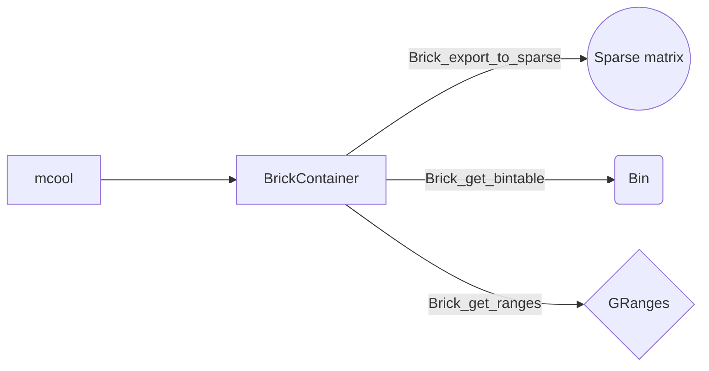

# 3d_genomes_glia

Dataset de [Dong-Sung Lee et al.](https://doi.org/10.1038/s41592-019-0547-z).

Disponibles para descargar [aquí](https://salkinstitute.app.box.com/s/fp63a4j36m5k255dhje3zcj5kfuzkyj1).

Paquetes [HiCBricks](http://www.bioconductor.org/packages/devel/bioc/vignettes/HiCBricks/inst/doc/IntroductionToHiCBricks.html#25_Exporting_data_from_Brick_objects) y [hicrep](https://github.com/TaoYang-dev/hicrep). 

# Pipeline


# Conda enviroment

Se creo iun ambiente para trabajar con Python la extracción de las matrices `.cool`.

1. `conda create -n cooler_data python=3.9 cooler numpy`
2. `conda env export --file cooler_test.yml`
3. `conda activate cooler_test`
4. `conda install ipython`
5. `ipython`
6. `nvim extraccin_HiC.py`
7. `python extraccion_HiC.py`
8. `conda deactivate`

El código generado que se fue modificando para cada tipo celular fue:

Para ODC, L4, Pvalb se uso en `matrix` la opción `balance=False`, ya que carecian de normalización. 

```
import cooler
import pandas as pd
import os.path

# Cargamos el archivo .cool
c = cooler.Cooler('../tmpTOP/data_raw/Human_cluster_mcool/L4_all_brain.txt_1kb_contacts.mcool::resolutions/10000')

# Para balancear los datos
#c = cooler.balance_cooler(c)

# Hacemos una lista de los cromosomas
chrs = ["chr1", "chr2", "chr3", "chr4", "chr5", "chr6", "chr7", "chr8","chr9",
"chr10","chr11","chr12","chr13","chr14","chr15","chr16","chr17","chr18","chr19","chr20","chr21", "chr22"]

for x in chrs:
             for y in chrs:
                 data = c.matrix(balance=True, as_pixels=True, join=True).fetch(x,y)
                 paths = '../tmpTOP/cells_HiC/l4/'
                 termination = x+y
                 paths_1 = os.path.join(paths, termination)
                 data.to_csv(paths_1, index = False, header = True)
                 print("Matriz: %s con %s" %(x,y))


  
