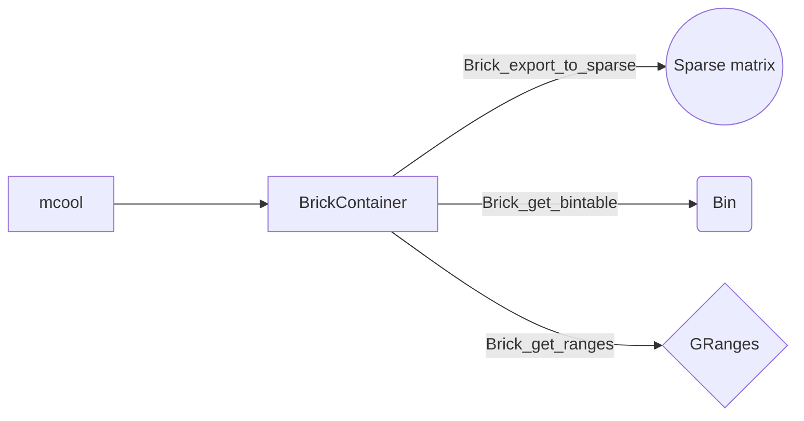

# 3d_genomes_glia

Dataset de [Dong-Sung Lee et al.](https://doi.org/10.1038/s41592-019-0547-z).

Disponibles para descargar [aquí](https://salkinstitute.app.box.com/s/fp63a4j36m5k255dhje3zcj5kfuzkyj1).

Paquetes [HiCBricks](http://www.bioconductor.org/packages/devel/bioc/vignettes/HiCBricks/inst/doc/IntroductionToHiCBricks.html#25_Exporting_data_from_Brick_objects) y [hicrep](https://github.com/TaoYang-dev/hicrep). 

# Pipeline

